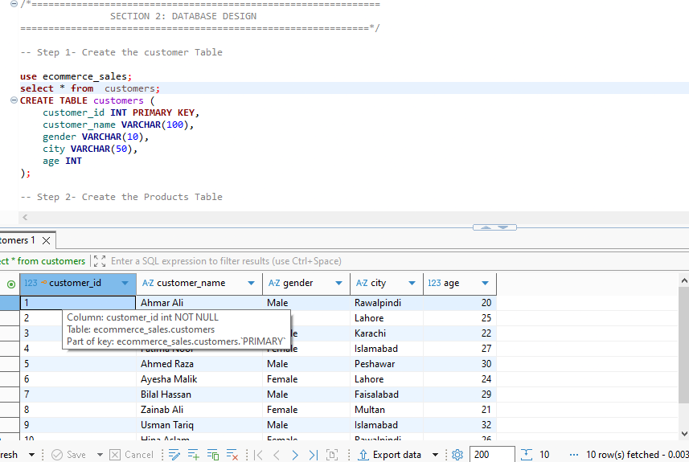
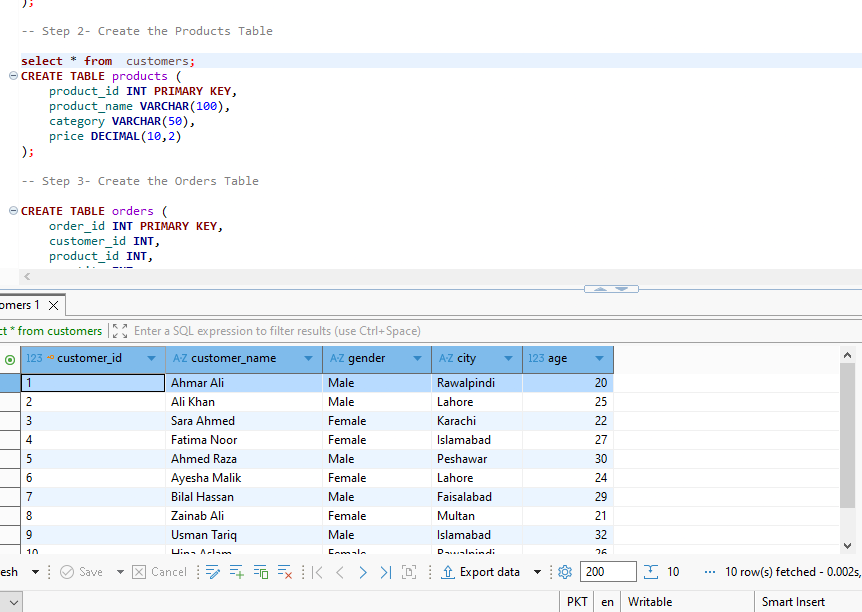
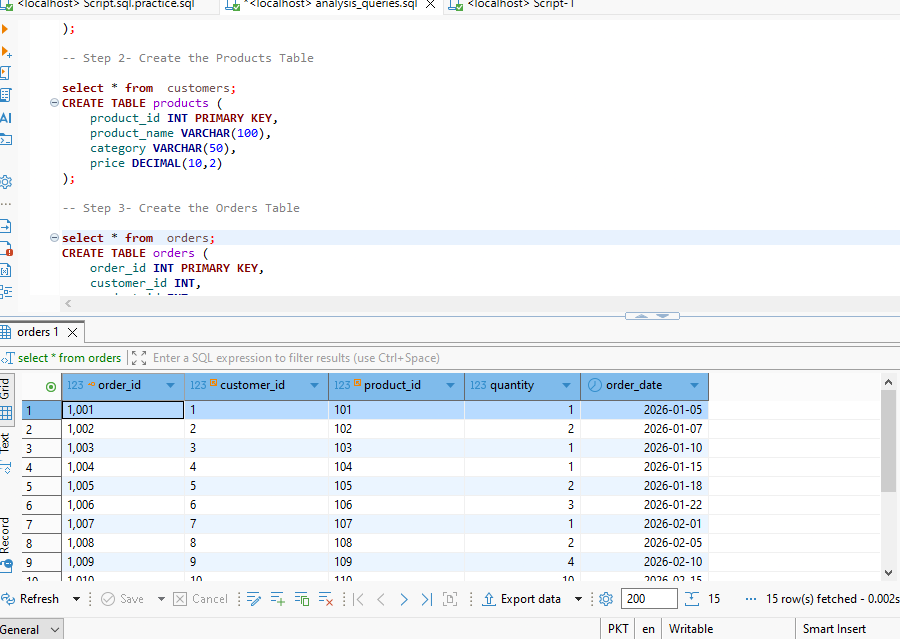
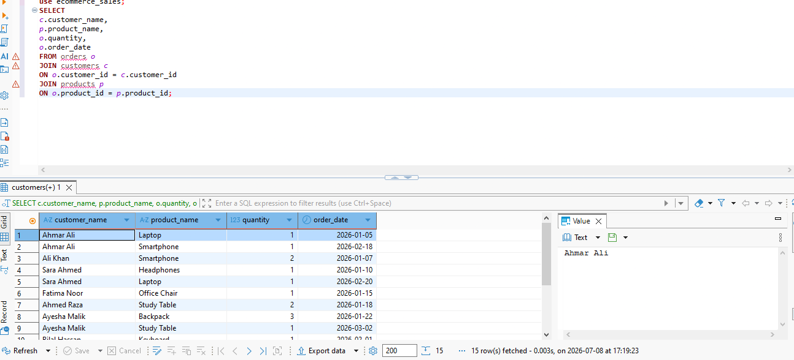
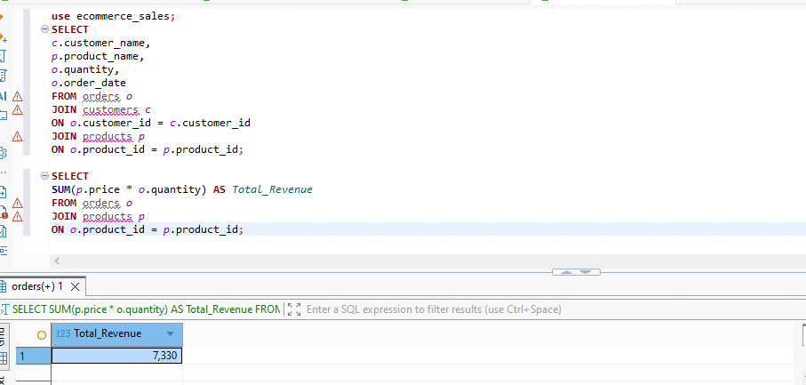
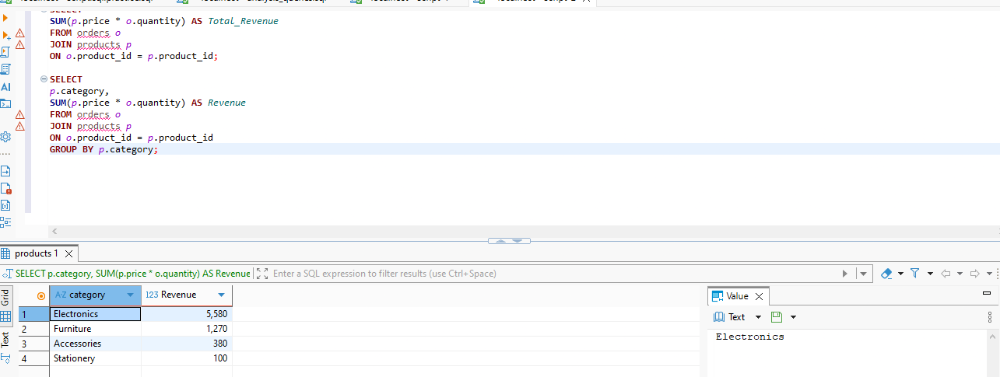
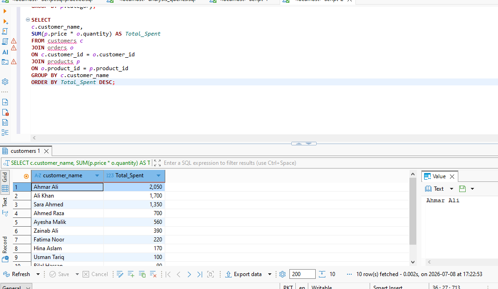
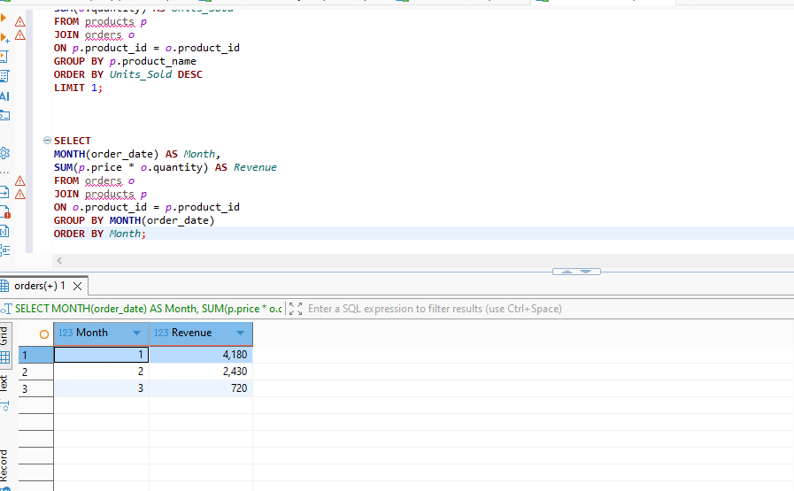
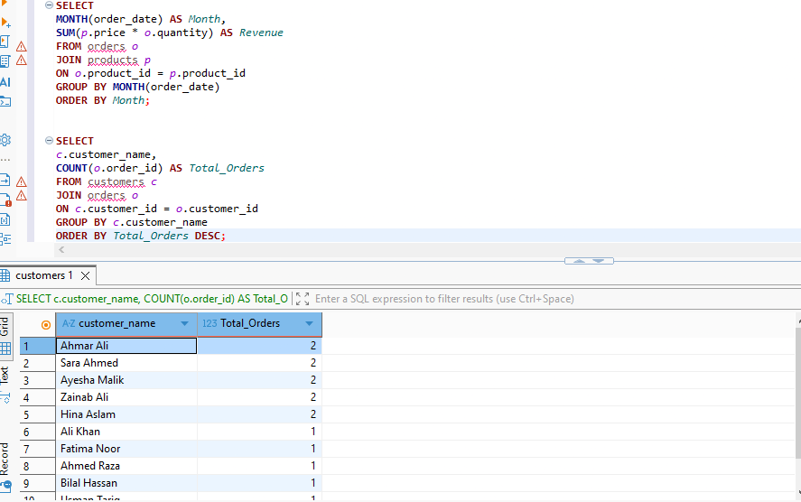
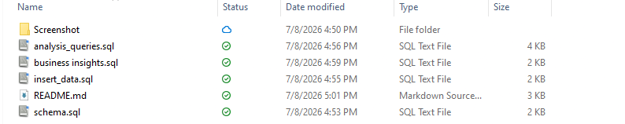

# E-Commerce Sales Analysis using SQL

## 📌 Project Overview

This project demonstrates how SQL can be used to design a relational database, populate it with data, and perform business analysis on an e-commerce sales dataset.

The project covers the complete SQL workflow, from creating the database to answering real-world business questions using analytical queries.

## 🎯 Objectives

- Design a relational database
- Create tables with primary and foreign keys
- Insert customer, product, and order data
- Perform business analysis using SQL
- Generate insights for decision-making

## 🛠️ Technologies Used

- MySQL
- DBeaver
- SQL

## 📂 Project Structure

SQL-ECommerce-Sales-Analysis/
│
├── schema.sql
├── insert_data.sql
├── analysis_queries.sql
├── business_insights.md
├── README.md
└── screenshots/

## 📊 Database Tables

The database contains three tables:

- Customers
- Products
- Orders

These tables are connected using Primary Keys and Foreign Keys.

## 📈 SQL Concepts Covered

- CREATE DATABASE
- CREATE TABLE
- INSERT INTO
- SELECT
- WHERE
- ORDER BY
- GROUP BY
- HAVING
- INNER JOIN
- COUNT()
- SUM()
- AVG()
- MAX()
- MIN()
- DISTINCT
- Aggregate Functions

## 💼 Business Questions Solved

- Total number of customers
- Average customer age
- Most expensive product
- Cheapest product
- Best-selling product
- Total revenue
- Revenue by category
- Revenue by month
- Customer spending analysis
- Orders per customer

## 🚀 Key Learning Outcomes

Through this project, I learned how to:

- Design relational databases
- Build relationships between tables
- Write analytical SQL queries
- Use JOIN operations
- Calculate business KPIs
- Transform raw data into business insights

## 📷 Project Screenshots

### 1. Database Structure

### 2. Customers Table

### 3. Products Table

### 4. Orders Table

### 5. Customer Purchases (JOIN Query)

### 6. Total Revenue Analysis

### 7. Revenue by Category

### 8. Customer Spending Analysis

### 9. Best Selling Product

### 10. Monthly Revenue Analysis

### 11. Orders Per Customer

### 12. Project Folder Structure

## 👨‍💻 Author

**Ahmar Ali**

BS Statistics  
Quaid-i-Azam University, Islamabad

Aspiring Data Analyst | SQL | Excel | Data Analytics
